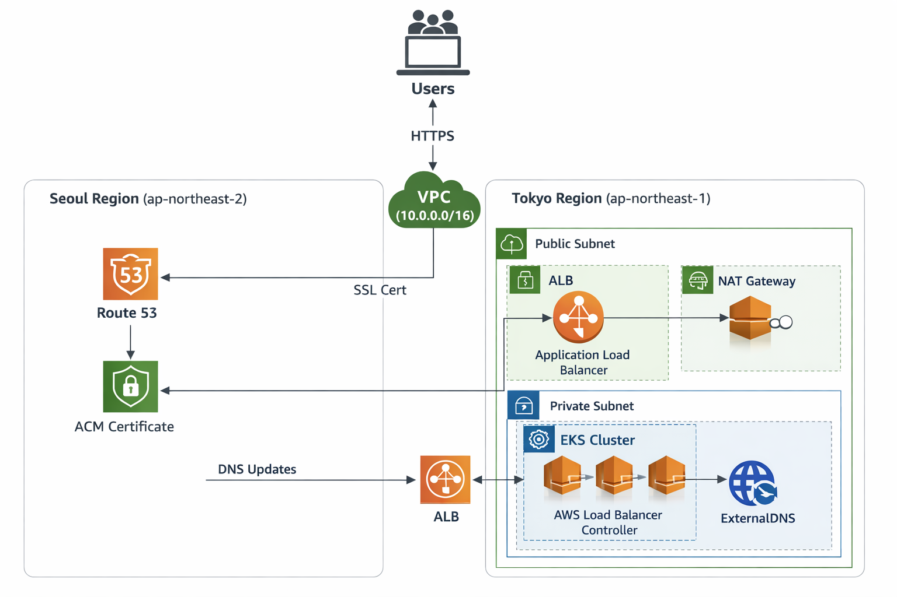

# AWS EKS Terraform 인프라 구축

Terraform(IaC)을 활용하여 AWS 도쿄 리전(ap-northeast-1)에 EKS 클러스터를 구축하고  
서울 리전(ap-northeast-2)의 Route53 및 ACM 자원을 연동하여 **도메인 및 HTTPS 구성을 자동화한 실습 프로젝트**입니다.

---

# Tech Stack

## Cloud
- AWS VPC
- AWS EKS
- AWS Route53
- AWS ACM
- AWS Application Load Balancer
- NAT Gateway

## Infrastructure as Code
- Terraform

## Container / Orchestration
- Docker
- Kubernetes (EKS)

## Automation / Add-ons
- Helm
- ExternalDNS
- AWS Load Balancer Controller
- EBS CSI Driver

---

# 주요 구현 내용

- Terraform을 이용한 **AWS EKS 인프라 자동화 구축**
- **VPC 네트워크 구성 (Public / Private Subnet 분리)**
- **IRSA(OIDC)** 기반 Kubernetes 서비스 계정 IAM 권한 관리
- Helm을 이용한 **AWS Load Balancer Controller 배포**
- **ExternalDNS + Route53 연동을 통한 DNS 자동 등록**
- **ACM 인증서를 활용한 HTTPS 트래픽 구성**
- Kubernetes Ingress 기반 **ALB 자동 생성 및 트래픽 라우팅**

---

# Architecture



사용자가 HTTPS로 접속하면 Route53을 통해 ALB로 트래픽이 전달되고  
ALB는 Private Subnet에 위치한 EKS Worker Node로 요청을 전달합니다.

ExternalDNS는 Kubernetes 리소스를 기반으로 Route53 DNS 레코드를 자동으로 생성 및 관리합니다.

---

## File Structure


eks-terraform/
├── main.tf # VPC, EKS 클러스터 및 Helm 차트 설정
├── iam.tf # OIDC 기반 IRSA IAM Role 구성
├── route53.tf # Route53 Hosted Zone 및 ACM 참조
├── outputs.tf # Terraform 출력 값
├── deploy-and-test.sh # 인프라 배포 및 kubeconfig 설정
├── check-external-dns.sh # ExternalDNS 상태 확인
├── test-external-dns.yaml # HTTPS 테스트용 Nginx 애플리케이션
└── policies/ # IAM Policy 정의


---

# Infrastructure 구성

## Networking

- **VPC CIDR** : 10.0.0.0/16
- **3개의 가용 영역(AZ) 사용**

### Public Subnet
- Application Load Balancer
- NAT Gateway

### Private Subnet
- EKS Worker Node 배치
- 외부 직접 접근 차단

### NAT Gateway
- Private Subnet Node의 인터넷 아웃바운드 트래픽 지원

---

## Computing

### EKS Cluster

- Kubernetes Version : 1.28
- Cluster Name : devsecops-eks

### Node Group

- Instance Type : t3.small
- Auto Scaling : 1 ~ 3 nodes

---

# Kubernetes Add-ons

## AWS Load Balancer Controller

- Kubernetes Ingress 리소스를 기반으로
- AWS Application Load Balancer 자동 생성

## ExternalDNS

- Kubernetes Service / Ingress 기반
- Route53 레코드 자동 생성 및 업데이트

## EBS CSI Driver

- Kubernetes Persistent Volume 사용을 위한
- AWS EBS 자동 프로비저닝

---

# 실행 가이드

## 1. 사전 준비

다음 항목을 확인합니다.

- `route53.tf`의 **Hosted Zone ID**
- `test-external-dns.yaml`의 **ACM Certificate ARN**

---

## 2. 인프라 배포

```bash
chmod +x *.sh
./deploy-and-test.sh

Terraform을 통해 다음 리소스가 생성됩니다.

- VPC
- EKS Cluster
- Node Group
- IAM Roles (IRSA)
- Kubernetes Add-ons

---

## 3. 기능 검증

### 테스트 애플리케이션 배포

```bash
kubectl apply -f test-external-dns.yaml

### ExternalDNS 상태 확인

```bash
./check-external-dns.sh

---

## 4. 결과 확인

다음 주소로 접속하여 도메인 및 HTTPS 적용 여부를 확인합니다.

'''bash
https://nginx.bluesunnywings.com

---

## 주의 사항

실습 후 AWS 비용 발생 방지를 위해 생성된 리소스를 반드시 삭제합니다.

'''bash
terraform destroy

